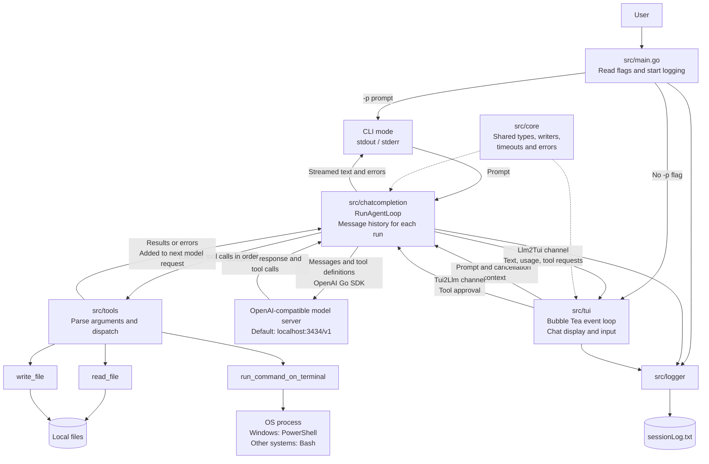

# GoCode

Go Code is an AI coding assistant that uses Large Language Models (LLMs) to
understand code and perform actions through tool calls.

The entry point for your `gocode` implementation is in `src/main.go`.

Originally started as a solution for the challenge ["Build Your own Claude Code"](https://codecrafters.io/challenges/claude-code) by [Codecrafters](https://codecrafters.io).

```
Note: Optimized for local model. Tested with qwen3.5:9b model running through ollama Q4_K_M quantization on a `RTX 3070` with `8GB vram`
```

## Get Started

- Ensure you have `go (1.26)` installed locally.
- Add 

### MacOS and linux

- Run `./start_gocode.sh` to build and run `gocode`, which is implemented in `src/main.go`.

OR

- Run `go run ./src` in the root directory

### Windows

- On Windows, run `start_gocode.bat` to build and run `gocode`.

OR

- Run `go run .\src\` in the root directory.

- Use commandline argument `-p "<your prompt>"` to run agent loop for your prompt.
- Use without params to use the TUI


## Architecture


