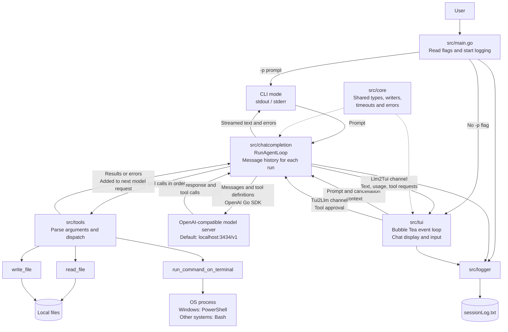

# GoCode

Go Code is an AI coding assistant that uses Large Language Models (LLMs) to
understand code and perform actions through tool calls.

The entry point for your `gocode` implementation is in `src/main.go`.

Originally started as a solution for the challenge ["Build Your own Claude Code"](https://codecrafters.io/challenges/claude-code) by [Codecrafters](https://codecrafters.io).

```
Note: Optimized for local model. Tested with qwen3.5:9b model running through ollama Q4_K_M quantization on a `RTX 3070` with `8GB vram`
```

## Get Started

- Ensure you have `go (1.26)` installed locally.
- Add 

### MacOS and linux

- Run `./start_gocode.sh` to build and run `gocode`, which is implemented in `src/main.go`.

OR

- Run `go run ./src` in the root directory

### Windows

- On Windows, run `start_gocode.bat` to build and run `gocode`.

OR

- Run `go run .\src\` in the root directory.

- Use commandline argument `-p "<your prompt>"` to run agent loop for your prompt.
- Use without params to use the TUI


## Jev API

The `src/jev` package uses Go's standard HTTP library to call the
[TypeSafe API](https://docs.typesafe.ai/api). Set `TYPESAFE_API_KEY` in the
environment before you create a client. No extra dependencies are needed.

Pass a slice of primitive questions. The result is a slice of answers in the
same order. The state and instructions can be strings, objects, or arrays.

```go
package main

import (
	"context"
	"fmt"
	"log"

	"github.com/t3snake/gocode/src/jev"
)

func main() {
	client, err := jev.NewClient()
	if err != nil {
		log.Fatal(err)
	}
	answers, err := client.Evaluate(context.Background(), "My payment failed.", []jev.Question{
		{Type: jev.Noul, Instructions: "Is this urgent?"},
		{
			Type: jev.Choice, Instructions: "Which team should handle this?",
			Criteria: map[string]any{"billing": "Payments and refunds", "technical": nil},
		},
		{
			Type: jev.Score, Instructions: "How frustrated is the customer?",
			Criteria: []string{"Calm", "Frustrated", "Very angry"},
		},
	})
	if err != nil {
		log.Fatal(err)
	}
	fmt.Println(answers[0].Noul, answers[1].Choice, answers[2].Score)
}
```

Noul returns a probability from 0 to 1. Choice returns an option name. Score
returns a weighted level index. Answers also retain the probabilities,
confidence, and legend where the API provides them.

The default model is `jev-latest`. Set `client.Model` to select another model.
The default HTTP timeout is one minute. Use the context to cancel a request,
or set `client.HTTPClient` to supply your own HTTP client. HTTP failures return
`*jev.APIError` with the status code and response body. Requests are not retried
automatically; use backoff before retrying status 429 or 529.

## Architecture


