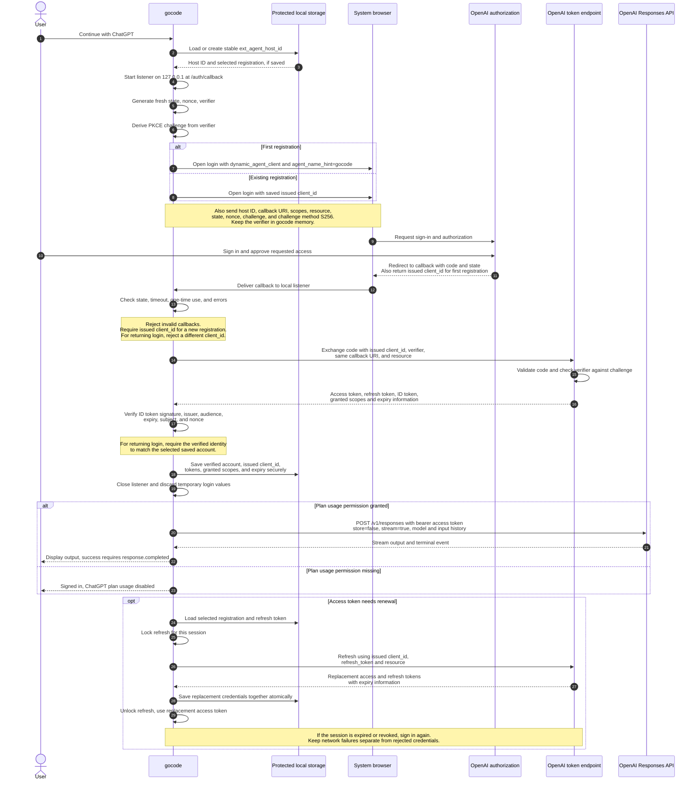

# Sign in with ChatGPT for gocode

Letting a user grant access without sharing their password is called **OAuth**. Verifying who signed in is provided by **OpenID Connect (OIDC)**. Sign in with ChatGPT (**SIWC**) uses both.

The browser returns to a small HTTP listener in gocode; this is the **callback**. A temporary code returned there is the **authorization code**, which gocode exchanges for credentials.

## Values used in the diagram

| Purpose | Name | Created by |
| --- | --- | --- |
| Stable identifier for this machine | `ext_agent_host_id` | gocode, once per host |
| Registration for the authorized account and workspace | `client_id` | OpenAI during first registration |
| Random value connecting the callback to the pending login | `state` | gocode, fresh per login |
| Random value connecting the signed identity document to the pending login | nonce | gocode, fresh per login |
| Proof that the app exchanging the code started the login | **PKCE** (Proof Key for Code Exchange) | gocode creates a secret verifier and its challenge |
| Fingerprint of the secret verifier | PKCE challenge | gocode: URL-safe encoding of SHA-256(verifier), without padding |
| Permissions requested or granted | scopes | gocode requests; OpenAI returns approved scopes |
| Credential for model requests | access token | OpenAI |
| Credential for renewing access | refresh token | OpenAI |
| Signed document identifying the user | ID token | OpenAI |

## Sequence



## What to keep

- **Persist:** stable host ID; each registration's issued client ID and verified issuer/subject; tokens; granted scopes; expiry information. Email or an account label helps the user choose a registration.
- **Memory only:** state, nonce, PKCE verifier/challenge, callback URI for the attempt, and authorization code. Discard after success, failure, or timeout.
- **Secret:** access and refresh tokens, and the PKCE verifier. Treat the ID token as sensitive too. Store tokens in protected storage; never put them in `sessionLog.txt`, source control, prompts, or tool output.
- **Not secret credentials:** host ID, client ID, scopes, expiry, and PKCE challenge. State and nonce travel through the browser but must be unpredictable. Protect stored account mappings from accidental replacement.

## Required checks and configuration

- Request identity scopes `openid profile email` and plan scopes `offline_access resource.invoke chatgpt.tokens.use.direct`. Check the returned scopes for `chatgpt.tokens.use.direct` before model requests.
- Use `http://127.0.0.1:<port>/auth/callback`, not `localhost`. Keep the exact URI during an attempt; only the port may vary between attempts.
- The ID token's fields are called **claims**: `iss` identifies the issuer, `aud` the intended client, `exp` the expiry, and `sub` the account. Verify the signature using OpenAI's published public keys, called **JWKS**, through a maintained library before trusting claims or nonce.
- No client secret is required. `dynamic_agent_client` starts registration; token exchange and refresh use the actual issued client ID.
- Keep registrations separate, even if their emails match. Serialize refreshes, including across processes, because refresh tokens are replaced.
- A protected file is an option: use owner-only permissions (`0600` on Unix) and atomic writes. Retain the ID token for later `id_token_hint` use; redact login URLs containing that hint.
- gocode currently calls Chat Completions. Add a Responses API path and adapt conversation history and tool messages for this SIWC route.

```text
Authorization: https://auth.openai.com/api/accounts/authorize
Token exchange and refresh: https://auth.openai.com/api/accounts/oauth/token
Resource: https://api.openai.com/v1
Model requests: https://api.openai.com/v1/responses
```

Official OpenAI documentation: [registration and sign-in](https://developers.openai.com/siwc/token-sharing-open-source/sign-in), [account storage and refresh](https://developers.openai.com/siwc/token-sharing-open-source/profiles-and-sessions), [Responses requests](https://developers.openai.com/siwc/token-sharing-open-source/models-and-inference).
